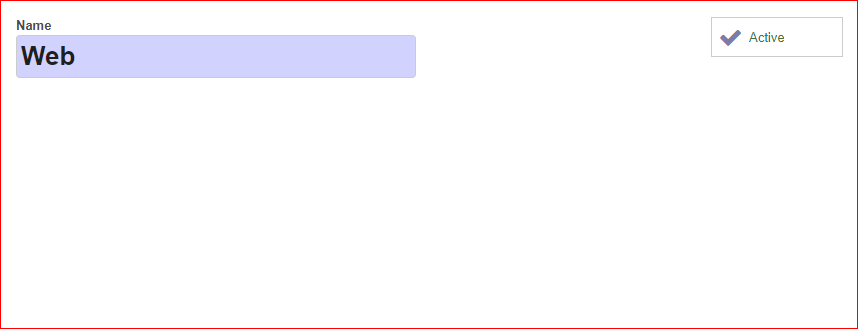
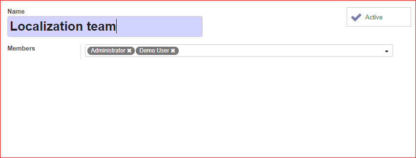
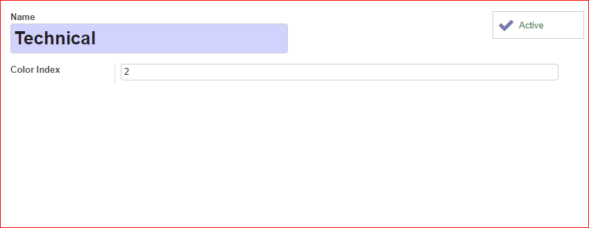

To configure this module, you need to:

1.  Edit or create new channels.
2.  Edit or create new categories.
3.  Edit or create new stages.
4.  Edit or create new teams.
5.  Edit or create new tags.

## Channels

1.  Go to *Helpdesk \> Configuration \> Channels* to edit or create new
    channels.
2.  Edit or create a channel.
3.  Set the name for the channel.
4.  You can also Activate or Deactivate channels.

## Categories

1.  Go to *Helpdesk \> Configuration \> Categories* to edit or create
    new categories.
2.  Edit or create a new category.
3.  Set the name for the category.
4.  You can also Activate or Deactivate categories.

## Stages

1.  Go to *Helpdesk \> Configuration \> Stages* to edit or create new
    stages.
2.  Edit or create a new stage.
3.  Set the name for the stage.
4.  Set the sequence order for the stage.
5.  You can select an Email template.
6.  Mark the Unattended checkbox if the stage contains unattended
    tickets.
7.  Mark the Closed checkbox if the stage contains closed tickets.
8.  You can add a description for the stage.
9.  You can also Activate or Deactivate stages.

You can also sort the stage sequence if you move up or down the stages
in the list view.

## Teams

1.  Go to *Helpdesk \> Configuration \> Teams* to edit or create new
    teams.
2.  Edit or create a new team.
3.  Set the name for the team.
4.  Add the teams members.
5.  You can also Activate or Deactivate teams.

## Tags

1.  Go to *Helpdesk \> Configuration \> Ticket Tags* to edit or create
    new tags.
2.  Edit or create a new tag.
3.  Set the name for the tag.
4.  Set the color index for the tag.
5.  You can also Activate or Deactivate tags.

## Permissions

There are restrictions to read tickets according to the user's
permissions set in Helpdesk.

1.  *User: Personal tickets*: User is able to see their tickets (those
    that are assigned to their user) or those that are no team nor user
    is assigned.
2.  *User: Team tickets*: User is able to see all the tickets that are
    assigned to the teams to which he/she belongs or the tickets that
    are not assigned to any team nor user.
3.  *User*: User is able to see all the tickets.
