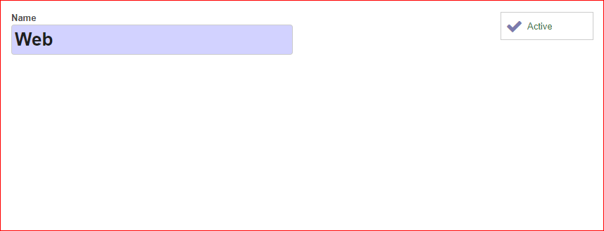
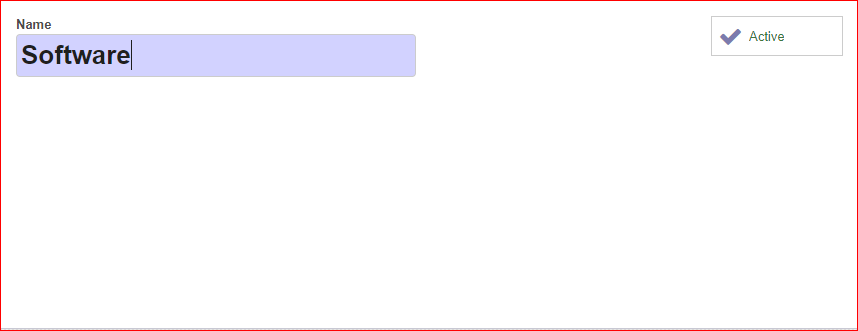
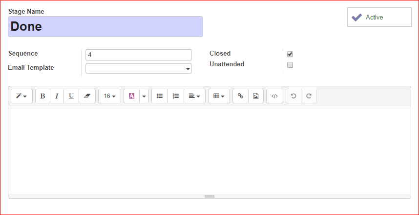
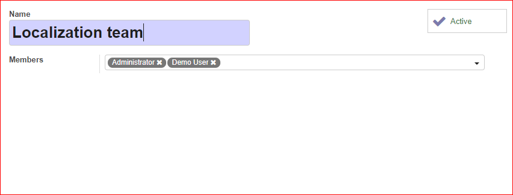
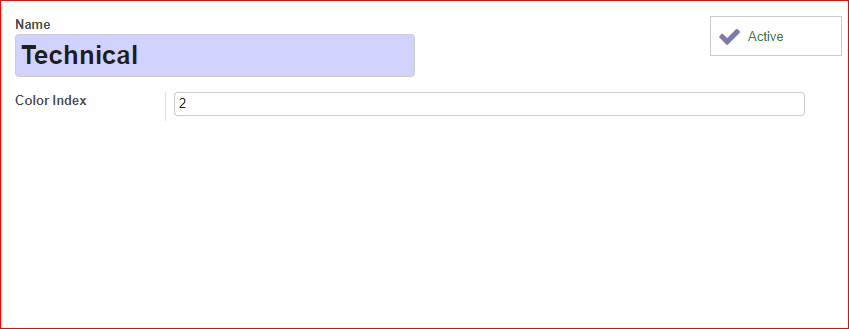

To configure this module, you need to:

#. Edit or create new channels.
#. Edit or create new categories.
#. Edit or create new stages.
#. Edit or create new teams.
#. Edit or create new tags.

Channels
~~~~~~~~

#. Go to *Helpdesk > Configuration > Channels* to edit or create new channels.
#. Edit or create a channel.
#. Set the name for the channel.
#. You can also Activate or Deactivate channels.

Categories
~~~~~~~~~~

#. Go to *Helpdesk > Configuration > Categories* to edit or create new categories.
#. Edit or create a new category.
#. Set the name for the category.
#. You can also Activate or Deactivate categories.

Stages
~~~~~~

#. Go to *Helpdesk > Configuration > Stages* to edit or create new stages.
#. Edit or create a new stage.
#. Set the name for the stage.
#. Set the sequence order for the stage.
#. You can select an Email template.
#. Mark the Unattended checkbox if the stage contains unattended tickets.
#. Mark the Closed checkbox if the stage contains closed tickets.
#. You can add a description for the stage.
#. You can also Activate or Deactivate stages.

You can also sort the stage sequence if you move up or down the stages in the list view.

Teams
~~~~~

#. Go to *Helpdesk > Configuration > Teams* to edit or create new teams.
#. Edit or create a new team.
#. Set the name for the team.
#. Add the teams members.
#. You can also Activate or Deactivate teams.

Tags
~~~~

#. Go to *Helpdesk > Configuration > Ticket Tags* to edit or create new tags.
#. Edit or create a new tag.
#. Set the name for the tag.
#. Set the color index for the tag.
#. You can also Activate or Deactivate tags.

Permissions
~~~~~~~~~~~

There are restrictions to read tickets according to the user's permissions set in Helpdesk.

#. *User: Personal tickets*: User is able to see their tickets (those that are assigned to their user) or those that are no team nor user is assigned.
#. *User: Team tickets*: User is able to see all the tickets that are assigned to the teams to which he/she belongs or the tickets that are not assigned to any team nor user.
#. *User*: User is able to see all the tickets.
