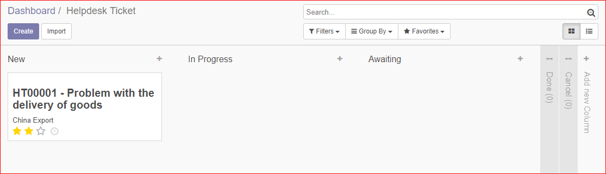
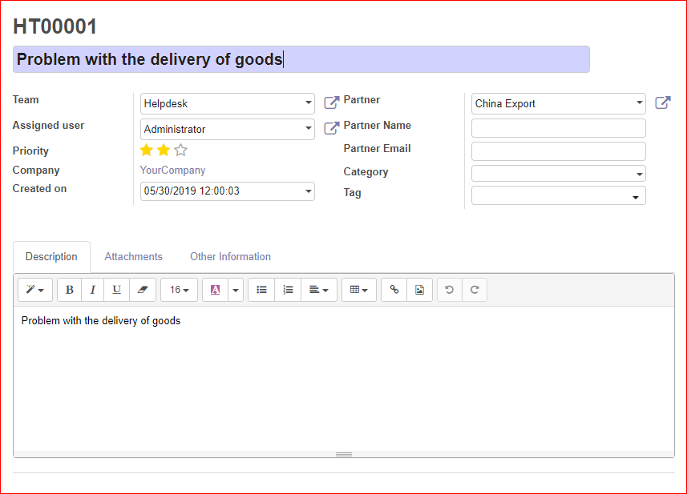

1.  Go to *Helpdesk* or *Helpdesk \> Dashboard* to see the tickets
    dashboard
2.  In the Kanban view, click in the kanban card of a team to see their
    tickets and create new ones.

To create a new ticket from the kanban view:

1.  Press *Create* button or click on the plus icon at the top of the
    column of a stage.
2.  Set the name or subject for the ticket.
3.  Select the team that will manage the ticket.
4.  You can select a user to assign the ticket.
5.  Set the priority of the ticket.
6.  Select the partner, and you can also set the partner name and email.
7.  You can select a category and set tags for the ticket.
8.  Add a description.
9.  You can also attach files to the ticket.

