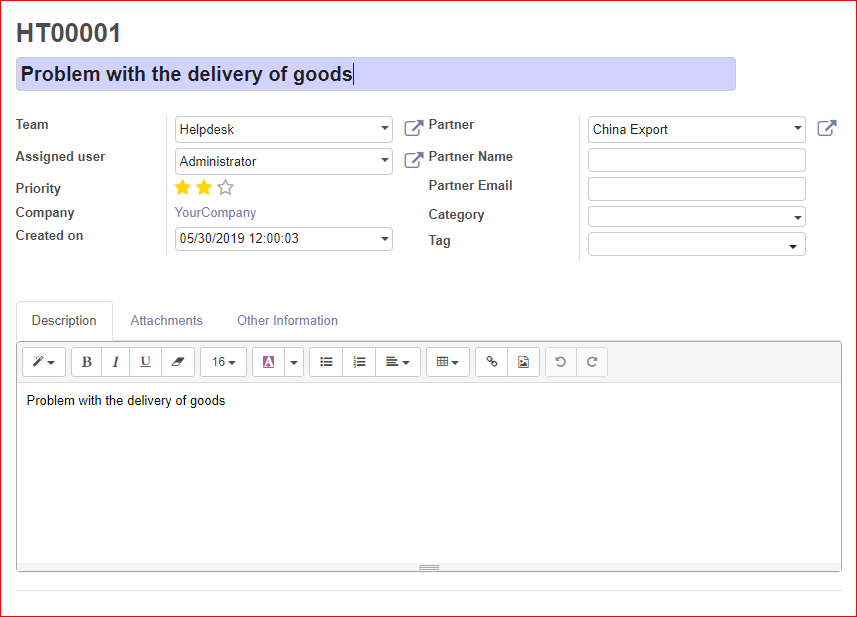

#. Go to *Helpdesk* or *Helpdesk > Dashboard* to see the tickets dashboard
#. In the Kanban view, click in the kanban card of a team to see their tickets and create new ones.

.. figure:: ../static/description/Tickets_Kanban.PNG
   :alt: Kanban view
   :width: 600 px

To create a new ticket from the kanban view:

#. Press *Create* button or click on the plus icon at the top of the column of a stage.
#. Set the name or subject for the ticket.
#. Select the team that will manage the ticket.
#. You can select a user to assign the ticket.
#. Set the priority of the ticket.
#. Select the partner, and you can also set the partner name and email.
#. You can select a category and set tags for the ticket.
#. Add a description.
#. You can also attach files to the ticket.

