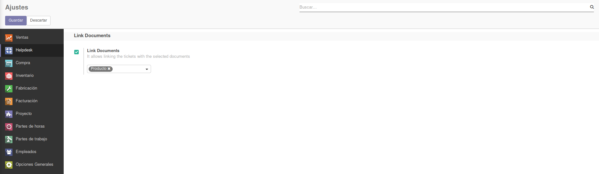
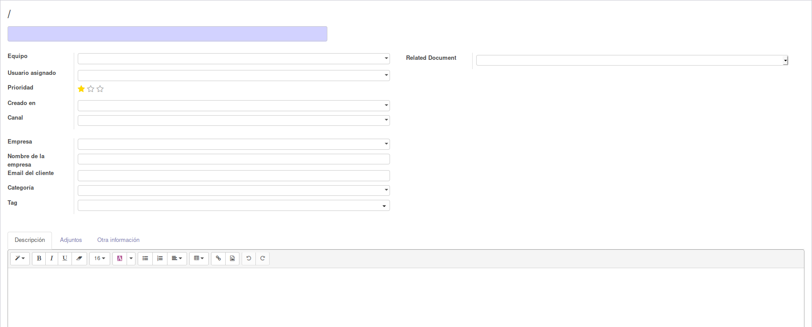

To configure this module, you need to:

#. Go to *Helpdesk > Configuration > Settings* and check the *Link Documents* field.
#. Select the documents you want to link to the tickets.
#. When creating a ticket, will appear in the creation form to select the chosen documents.

