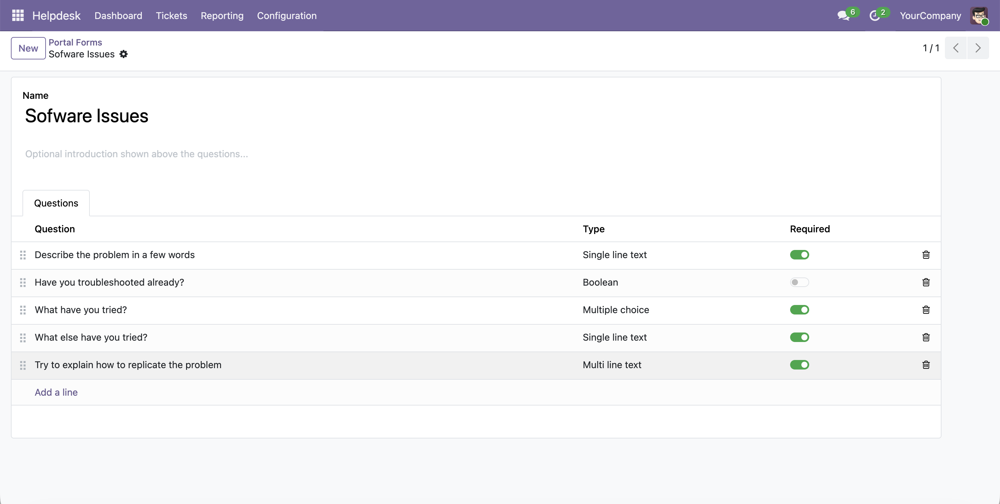

The portal form only appears when categories are selectable in the portal.

1.  Go to *Helpdesk > Configuration > Settings* and enable **Select category in Helpdesk portal**.
2.  Go to *Helpdesk > Configuration > Portal Forms* and create a form, give it a name, an optional introduction, and add questions. Each question has a type (single line text, multi line text, single choice, multiple choice, or yes/no) and can be marked as required. Single and multiple choice questions hold their own list of choices. This module also includes support for conditional questions.

3.  Go to *Helpdesk > Configuration > Categories*, open a portal-visible category and set its **Portal Form**.

Categories left without a portal form keep the standard free-text
description.
