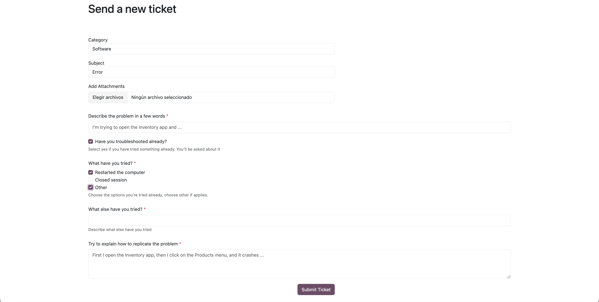
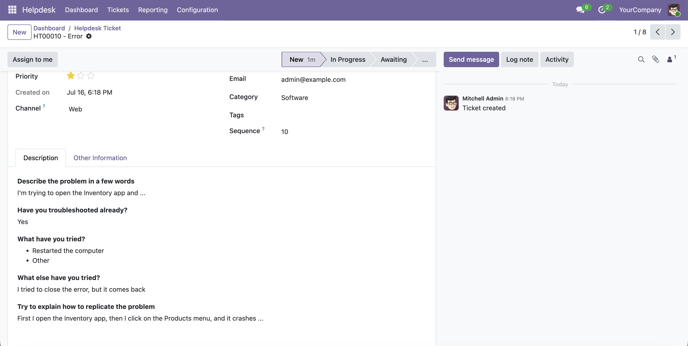

On the portal, a customer opening *Submit a Ticket* selects a category as usual. If that category has a portal form, its questions appear immediately below the category, replacing the free-text description. Subject and attachments behave as before.

On submit, the answers are formatted and stored as the ticket description, where agents and notification emails read them like any other description.

